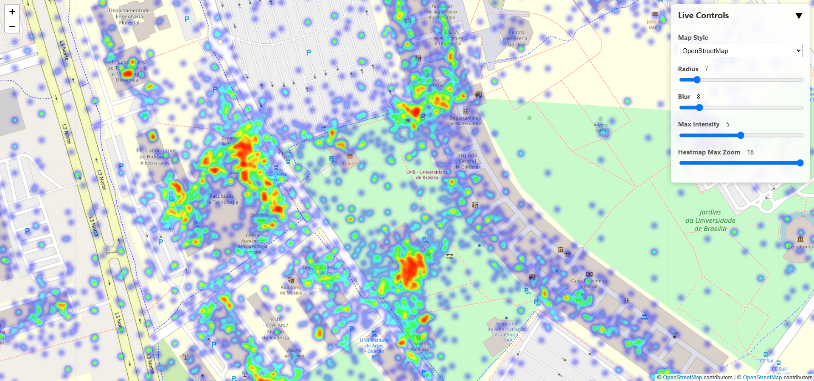

# Google Location History Heatmap Generator

This project provides a Python script that processes your Google Takeout Location History data (`Records.json`) and generates a beautiful, interactive, single-file HTML heatmap to visualize your life's travels.

The script is designed to be highly configurable, efficient with large data files, and entirely offline, ensuring your location data remains private. The final output is a single `heatmap.html` file that you can open in any web browser.



## Features

- **Privacy First**: All processing is done locally on your machine. Your location data is never uploaded.
- **Universal Parser**: Automatically detects and parses both the old (`locations`) and new (`semanticSegments`) formats of Google's location history.
- **Efficient**: Uses a streaming JSON parser (`ijson`) to handle multi-gigabyte data files with low memory usage.
- **Interactive UI**: The generated HTML file includes a live control panel to customize the visualization in real-time.
- **Self-Contained Output**: The script generates a single `heatmap.html` file with all necessary CSS and JavaScript embedded.

## How to Use

### Step 1: Get Your Location Data

1. Go to your device's main Settings menu, not within the Google Maps app itself.
2.  Navigate to the Location menu.
3.  Select Location Services.
4.  Tap on Timeline (this may also be called "Google Location History").
5.  Find the settings option (often a ⋮ icon) and choose to Export timeline data.
6.  Once exported, find the `Records.json` file inside the repository directory.

### Step 2: Set Up the Environment

1.  **Clone the repository** or download the `generate_heatmap.py` script.
2.  **Place your `Records.json`** file in the same directory as the script.
3.  **Install the required Python package**:
    ```bash
    pip install -r requirements.txt
    ```

### Step 3: Configure and Run the Script

1.  **(Optional) Customize the initial view**: Open the `generate_heatmap.py` file and edit the `CONFIG` dictionary at the top to set your preferred initial zoom, map center, colors, and other defaults.
2.  **Run the script** from your terminal:
    ```bash
    python generate_heatmap.py
    ```
3.  The script will process your data and automatically open the generated `heatmap.html` file in your default web browser.

## Understanding the Live Controls

- **Map Style**: Changes the underlying base map. "OpenStreetMap" is often best for viewing the heatmap.
- **Radius**: Increases or decreases the size of the "glow" for each data point.
- **Blur**: Adjusts the smoothness of the heat areas.
- **Max Intensity**: A powerful setting for tuning the map's "sensitivity". A **lower** value makes the map appear "hotter" with less data, ideal for sparse histories. A **higher** value requires a greater concentration of data to show "hot" (red) areas.
- **Heatmap Max Zoom**: An advanced setting that controls the zoom level at which the heatmap is rendered at its highest detail.